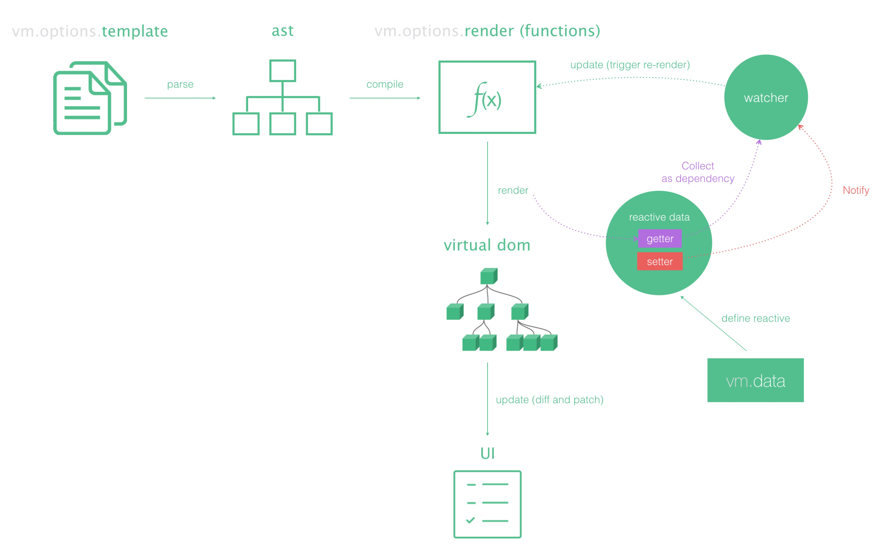

正文
---
```javascript
  function initMixin (Vue) {
    Vue.prototype._init = function (options) {
      var vm = this;
      // a uid
      vm._uid = uid$3++;
      
      var startTag, endTag;
      /* istanbul ignore if */
      if (config.performance && mark) {
        startTag = "vue-perf-start:" + (vm._uid);
        endTag = "vue-perf-end:" + (vm._uid);
        mark(startTag);
      }
      // 如果是Vue 的实例,则不需要被observe
      // a flag to avoid this being observed
      vm._isVue = true;
      // merge options
      // 第一步 options参数的处理
      if (options && options._isComponent) {
        // optimize internal component instantiation
        // since dynamic options merging is pretty slow, and none of the
        // internal component options needs special treatment.
        initInternalComponent(vm, options);
      } else {
        //  mergeOptions // 合并选项 
        vm.$options = mergeOptions(
          resolveConstructorOptions(vm.constructor),
          options || {},
          vm
        );
      }
      // 第二步 renderProxy
      /* istanbul ignore else */
      {
        initProxy(vm);
      }
      // expose real self
      vm._self = vm;
      // 第三步 vm 的生命周期相关变量初始化
      initLifecycle(vm);
      // 第四步 vm 的事件监听初始化
      initEvents(vm);
      // 第五步 vm 的编译render 初始化
      initRender(vm);
      // 第六步 vm 的beforeCreate 生命钩子的回调
      callHook(vm, 'beforeCreate');
      // 第七步 vm在data/props初始化之前要进行绑定
      initInjections(vm); // resolve injections before data/props
      // 第八步 vm的state状态初始化
      initState(vm);
      // 第九步 vm的 在data/props 之后要进行提供
      initProvide(vm); // resolve provide after data/props
      // 第十步 vm 的created 生命钩子的回调
      callHook(vm, 'created');
      
      /* istanbul ignore if */
      if (config.performance && mark) {
        vm._name = formatComponentName(vm, false);
        mark(endTag);
        measure(("vue " + (vm._name) + " init"), startTag, endTag);
      }
      // 第十一步 render & mount
      if (vm.$options.el) {
        vm.$mount(vm.$options.el);
      }
    };
  }
```
主要是为我们的Vue原型上定义一个方法_init。然后当我们执行new Vue(options)的时候,会调用这个方法。而
这个_init方法的实现,便是我们需要关注的地方。前面定义vm实例都挺好理解,主要看一下mergeOptions这个方
法,其实在Vue实例化的过程中,会在代码运行后增加很多新的东西。我们把我们传入的这个对象叫options实例中
我们可以通过vm.$options访问到

0至5071行总结

从 0 至 5000 行我们可以清晰看到 Vue 模板编译的轮廓了。

  * 笔者将这一部分出现的关键词进行按顺序罗列：
  1. function (global, factory)
  2. 工具函数
  3. Dep
  4. Observe
  5. VNode
  6. nextTick
  7. 事件机制
  8. Render
  9. components
  10. Watcher
我们可以总结：Vue 的核心就是 VDOM ！对 DOM 对象的操作调整为操作 VNode 对象，采用 diff 算法比较差异，一次 patch。

render 的流程是:
  1. Vue使用HTML的Parser将HTML模板解析为AST
  2. function render(){}
  3. Virtual DOM
  4. watcher将会在组件render的时候收集组件所依赖的数据，并在依赖有更新的时候，触发组件重新渲染
