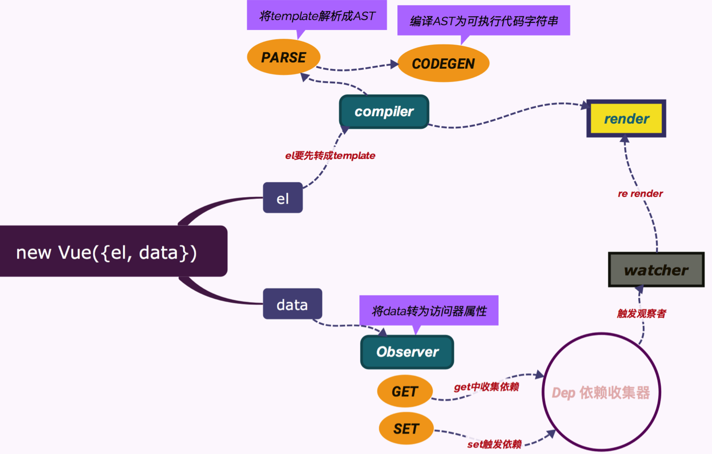

正文
---
**第5073行至第5446行**
```javascript
// 定义VUE 构造函数
function Vue(options) {
  if (!(this instanceof Vue)){
    warn('Vue is a constructor and should be called with this `new` keyword ');
  } 
  this._init(options)
}
// 将 Vue 作为参数传递给导入的五个方法
initMixin(Vue); // 初始化 Mixin
stateMixin(Vue); //  状态 Mixin
eventsMixin(Vue); // 事件  Mixin
lifecycleMixin(Vue); // 生命周期 Mixin
renderMixin(Vue); // 渲染 Mixin
```
这一部分就是初始化函数的调用
```javascript
Object.defineProperty(Vue.prototype,$isServer,{
  get:isServerRendering
})
```
为什么这么写?
Object.defineProperty 能保护引入的库不被重新赋值,如果你常识重写,程序会抛出
"TtpeError:Cannot assign to read only property"的错误。
阶段小结
这一部分是Vue index.js 的内容,包括Vue 的整个挂在过程
1. 先进入 initMixin(Vue),在propertype上挂载
```javascript
Vue.propertype._init = function(options){}
```
2. 进入stateMixin(Vue),在propertype上挂载Vue.propertype.$data
```javascript
Vue.prototype.$props 
Vue.prototype.$set = set 
Vue.prototype.$delete = del 
Vue.prototype.$watch = function(){} 
```
3. 进入eventsMixin(Vue), 在prototype上挂载
```javascript
Vue.prototype.$on 
Vue.prototype.$once 
Vue.prototype.$off 
Vue.prototype.$emit
```
4. 进入lifecycleMixin(Vue), 在prototype上挂载
```javascript
Vue.prototype._update 
Vue.prototype.$forceUpdate 
Vue.prototype.$destroy
```
5. 最后进入renderMixin(Vue),在prototype上挂载 Vue.prototype.$nextTick
```javascript
Vue.prototype._render 
Vue.prototype._o = markOnce 
Vue.prototype._n = toNumber 
Vue.prototype._s = toString 
Vue.prototype._l = renderList 
Vue.prototype._t = renderSlot
Vue.prototype._q = looseEqual 
Vue.prototype._i = looseIndexOf 
Vue.prototype._m = renderStatic 
Vue.prototype._f = resolveFilter 
Vue.prototype._k = checkKeyCodes 
Vue.prototype._b = bindObjectProps 
Vue.prototype._v = createTextVNode 
Vue.prototype._e = createEmptyVNode 
Vue.prototype._u = resolveScopedSlots 
Vue.prototype._g = bindObjectListeners
```
> mergeOptions 使用策略模式合并传入的options 和Vue.options合并后的代码结构,可以看到通过合并
策略components.directives.filters继承了全局的,这就是为什么全局注册的可以在任何地方使用,因为
每个实例都继承了全局的,所以都能找到。

new 一个 Vue对象发生了什么 

