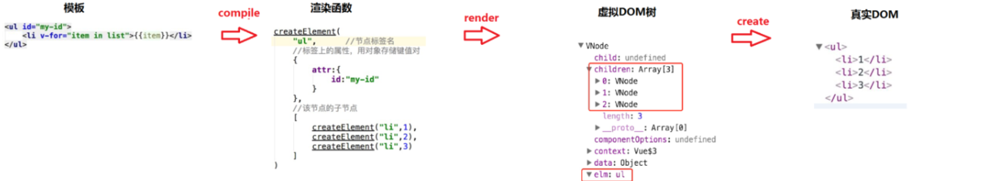

正文
---
**第7473行至第7697行**
  * normalizeEvents   //  为事件多添加change或者input事件加进去
  * createOnceHandler$1   
  * add$1   // 为真实的dom添加事件
  * remove$2
  * updateDOMListeners  // 更新dom 事件
  * updateDOMProps    // 更新真实dom的props属性
  * shouldUpdateValue   // 判断是否需要更新value
  * isNotInFocusAndDirty
  * isDirtyWithModifiers  //  判断脏数据修改
**第7699行至第7797行**
  * domProps  
  * parseStyleText 
  * normalizeStyleData    //  合并同一vnode上的静态和动态样式数据
  * normalizeStyleBinding //  将可能的数组/字符串值规范化为对象
  * getStyle
```javascript
  /**
   * parent component style should be after child's
   * so that parent component's style could override it
   * 父组件样式应该在子组件样式之后
   * 以便父组件的样式可以覆盖它
   * 循环子组件和组件的样式,把它全部合并到一个样式对象中返回样式对象 如{width:1000px,height:200px}返回该字符串
   */
```
  * setProp // 设置prop 
**第7799行至第7995行**
  * normalize //  给css加前缀。解决浏览器兼容性问题,加前缀
  * updateStyle   // 将vnode虚拟dom的css转义成并且渲染到真实dom的css
  * addClass // 为真实dom元素添加class类
  * removeClass // 删除真实dom的class类
  * resolveTransition // 解析vnode中的transition的name属性获取到一个css过渡对象类
  * autoCssTransition // 通过name属性获取过渡css类名 比如标签上面定义name是fade css就要定义. .fade-enter-active,
    .fade-leave-active,.fade-enter,.fade-leave-to这样的css
  * nextFrame //  下一帧
**第7997行至第8093行**
  * addTransitionClass  // 获取真实dom addTransitionClass记录class类
  * removeTransitionClass // 删除vnode的class类和删除真实dom的class类
  * whenTransitionEnds // 获取动画的信息, 执行动画。
  * getTransitionInfo // 获取transition,或者animation动画的类型,动画个数,动画执行时间
  这一部分关于:对真实dom的操作,包括样式的增删、事件的增删、动画类。
  回过头在理一下宏观上的东西, 虚拟DOM -> 渲染函数 -> 虚拟DOM树 -> 真实DOM
  
