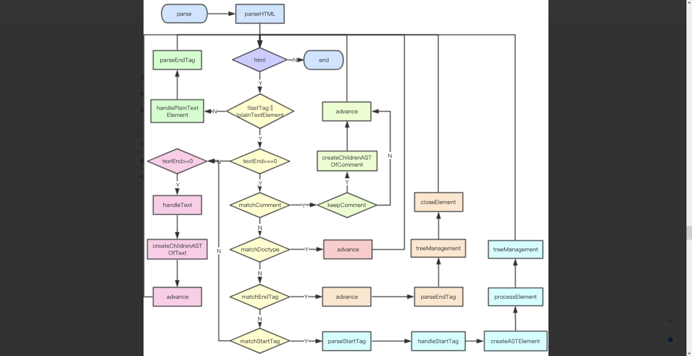
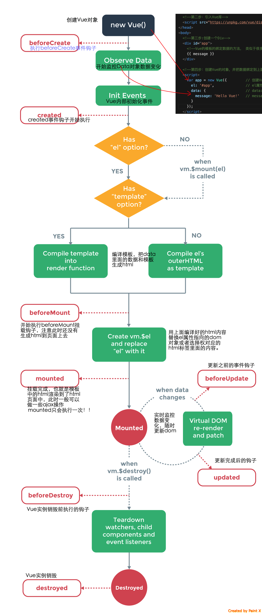
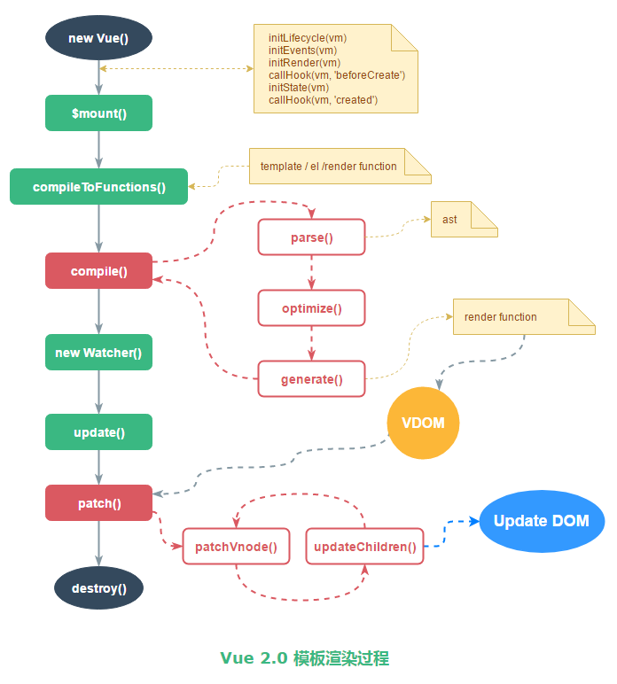

正文
---
**第9541行至第9914行**
  Regular Expressions
  * createASTElement  // Convert HTML string to AST.
  * parse //  !important
  parse函数从9593行至第9914行,共三百多行。核心吗?当然核心!
  引自 Wikipedia:
  > 在计算机科学和语言学中，语法分析（英语：syntactic analysis，也叫 parsing）是
    根据某种给定的形式文法对由单词序列（如英语单词序列）构成的输入文本进行分析并
    确定其语法结构的一种过程。
    语法分析器(parser)通常是作为编译器或解释器的组件出现的，它的作用是进行语法检查
    、并构建由输入的单词组成的数据结构（一般是语法分析树、抽象语法树等层次化的数据
    结构）。语法分析器通常使用一个独立的词法分析器从输入字符流中分离出一个个的“单
    词”，并将单词流作为其输入。实际开发中，语法分析器可以手工编写，也可以使用工
    具（半）自动生成。
    
  parse的整体流程实际上就是先处理了一些传入的options,然后执行了parseHTML函数,传入了
  template,options和相关钩子。
  具体实现
  
  parse中的语法分析可以看  [这一篇这一节][1].
  
  [1]: https://juejin.im/post/5d09a4fef265da1b6b1cd96b#heading-13
  
    1. start
    2. char 
    3. comment 
    4. end
  parse、optimize、codegen的核心思想解读可以看 [这一篇这一节][2].
  
  [2]: https://juejin.im/post/5cfc6ad9e51d4558936aa04d#heading-6
  
  细节:
    1. parse
    2. optimize
    3. codegen for render And render
  后续部分都与这三点相关
**阶段小结(重点)**
前20篇的小结! 
官方有这样一句话:
  > 下图展示了实例的生命周期. 你不需要立马弄明白所有的东西,不过随着你的不断学习和使用，
  她的参考价值会越来越高
  
  
  
  上图值得一提的是: Has"template" option? 这个逻辑的细化
  > 碰到是否有template选项时, 会询问是否要对template进行编译:即模板通过编译生成AST,
    再由AST生成Vue的渲染函数,渲染函数结合数据生成Virtual DOM树,对Virtual DOM进行
    diff和patch后生成新的UI。
    
  如图
  
  
  将Vue的源码的"数据监听"、"虚拟DOM"、"Render函数"、"组件编译"。结合好,就算是融会贯通了!
  一图胜万言
  
  
  
