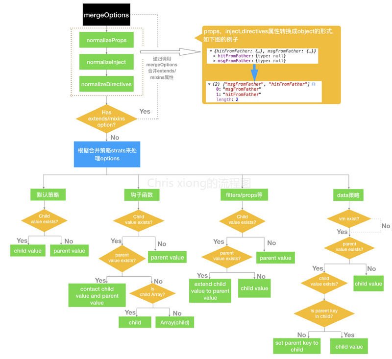

### 正文
**第904行至第1073行**
Vue核心: 数据监听最重要之一的Observer
  * 核心中的核心! Observer(发布者) ==> Dep(订阅器) ==> Watcher(订阅者) 
  类比一个生活场景:报社将各种时下热点的新闻收集,然后制成各类报刊,发送到每家门口的邮箱,订阅报刊的人们看到了新闻,对新闻做出评论
  在这个场景里 报社 == 发布者, 新闻 == 数据, 邮箱 == 订阅器,订阅报刊的人 == 订阅者,对新闻评论 == 视图更新  
  * Observer // Observer 的调用过程: initState() --> observer(data) --> new Observer()
```javascript
var Observer = function Observer(value) {
  this.value = value;
  this.dep  = new Dep();
  this.vmCount = 0;
  def(value,'__ob__',this)
  if(Array.isArray(value)){
    if(hasProto){
      protoAugment(value,arrayMethods);
    } else {
      copyAument(value,arrayMethods,arrayKeys)
    }
    this.observeArray(value)
  } else {
    this.walk(value)
  }
}
```
  * ※※ defineReactive 函数,定义一个响应式对象,给对象动态添加getter和setter,用于依赖收集和派发更新。
```vue
function defineReactive(
  obj: Object,
  key: string,
  val: any,
  costomSetter?: ?Function,
  shallow?:boolean
  ) {
    const dep = new Dep() // 1.为属性创建一个发布者
    
    const property = Object.getOwnPropertyDescriptor(obj,key)
    if(property && property.configurable === false){
      return
    }
    
    // cater for pre-defined getter/setters
    const getter = property && property.get // 依赖收集
    const setter = property && property.set // 派发更新
    if((!getter || setter) && arguments.length === 2){
      val = obj[key]
    }
    
    let childOb = !shallow && observe(val) // 2.获取属性值的__ob__属性
    Object.defineProperty(obj,key,{
    ennmerable: true,
    configurable:true,
    get:function reactiveGetter(){
      const value = getter ? getter.call(obj) : val
      if(Dep.target){
        dep.depend() // 3. 添加Dep
        if(childOb){
          childOb.dep.depend() // 4.也为属性值添加同样的Dep
          if(Array.isArray(value)){
            dependArray(value)
          }
        }
      }
      return value
    },
    set:function reactiveSetter (newVal){
    const value = getter ? getter.call(obj):val
        /* eslint-disable no-self-compare */
        if(newVal === value || (newVal !== newVal && value !== value)){
          return
        }
        /* eslint-enable no-self-compare */
        if(process.env.NODE_ENV !== 'production' && customSetter){
          customSetter()
        }
        if(setter){
          setter.call(obj,newVal)
        } else {
          val = newVal
        }
        childOb = !shallow && observe(newVal)
        dep.notify()
      }
    })
}
```
第四部非常重要,为对象的属性添加 dep.depend(), 达到监听对象(引用的值)属性的目的

### 重点备注
  Vue 对数组的处理跟对象还是有挺大的不同, length 是数组的一个很重要的属性,无论数组增加元素或者删除元素(通过splice,push等方法操作)length的值必定会更新,为什么不直接操作监听length呢?而需要拦截splice,push等方法进行数组的状态更新?  
  原因是: 在数组length属性上用defineProperty拦截的时候,会报错。
```javascript
Uncaught TypeError: Cannot redefine property:length
```
再用Object.getOwnPropertyDescriptor(arr,'length') 查看一下: //
(Object.getOwnPropertyDescriptor用于返回defineProperty.descriptor)
{configurable:false,enumerable:false,value:0,writable:true} configurable为false,切MDN上也说重定义数组的length属性在不同浏览器上表现也是不一致的,所以还是老老实实拦截splice,push等方法,或者使用ES6的Proxy
**第1075行至第1153行**
  * set // 在对象上设置一个属性. 如果是新的属性就会触发更改通知(旧属性也会触发更新通知,因为第一个添加的时候已经监听了,之后自动触发,不在手动触发)
  * del // 删除一个属性,如果必要触发通知
  * dependArray // 手机数组的依赖  
**第1157行至第1568行**
// 配置选项合并策略
```javascript
ar strats = config.optionMergeStrategies;
```
  * mergeData
  * strats.data
  * mergeDataOrFn
  * mergeHook
  * mergeAssets
  * strats.watch
  * strats.computed
  * defaultStrat
  * checkComponents
  * validateComponentName
  * normalizeProps
  * normalizeInject
  * normalizeDirectives
  * assertObjectType
  * mergeOptions
这一部分代码写的就是父子组件配置项的合并策略,包括:默认的合并策略、钩子函数的合并策略、filter/props、data合并策略,
且包括标准的组件名、props写法有一个统一化规范要求  
以图示之

阶段小结: 这一部分最重要的就是Observer(观察者), 这也是Vue核心中的核心！其次是mergeOptions(组件配置项的合并策略)
