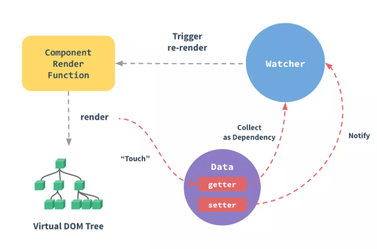

正文
---
**第4231行至第4406行**
  * resetSchedulerState // 重置状态
  * flushSchedulerQueue // 据变化最终会把flushSchedulerQueue传入到nextTick中执行
  flushSchedulerQueue函数会遍历执行watcher.run()方法,watcher.run()方法最终会完成视图更新
  
  vue中dom的更像并不是实时的,当数据改变后,vue会把渲染watcher添加到异步队列,异步执行,同步
  代码完成后再统一修改DOM
  * callUpdatedHooks
  * queueActivatedComponent
  * callActivatedHooks
  * queueWatcher  
  
**第4412行至第4614行**
  * Watcher // !important 重中之重的重点
  这一 part 在Watcher的原型链上定义了get、addDep、cleanupDeps、update、run、evaluate、depend、
  teardown 方法,即 Watcher 的具体实现的一些方法,比如新增依赖、清除、更新视图等。
  每个Vue组件都有一个对应的 watcher, 这个watcher将会在组件render的时候收集组件所依赖的
  数据,并在依赖有更新的时候,触发组件重新渲染。 
